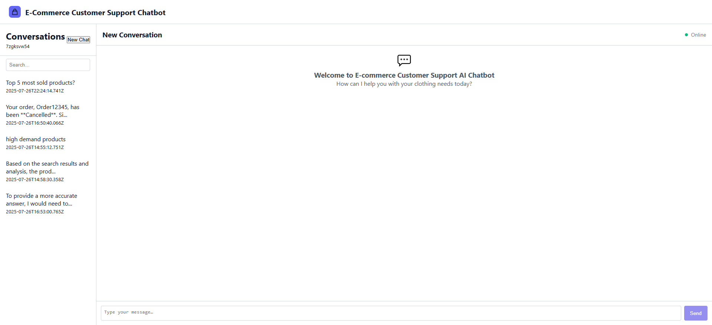
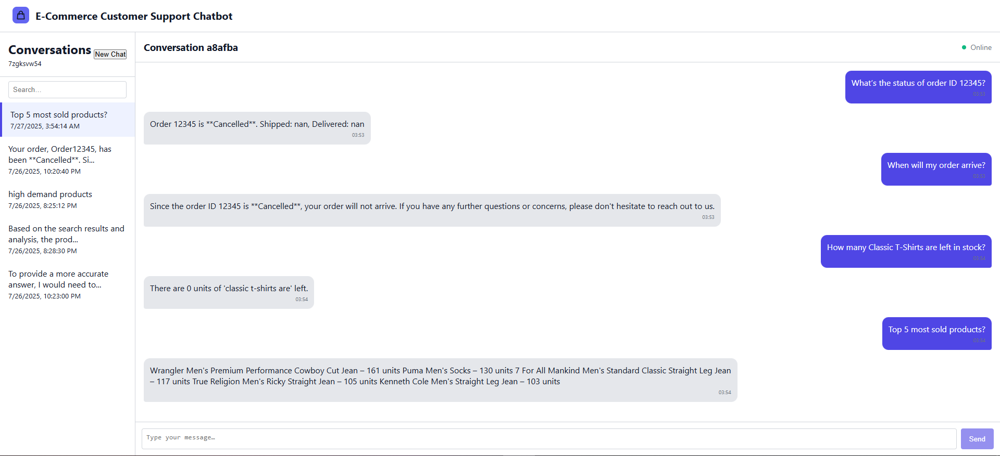
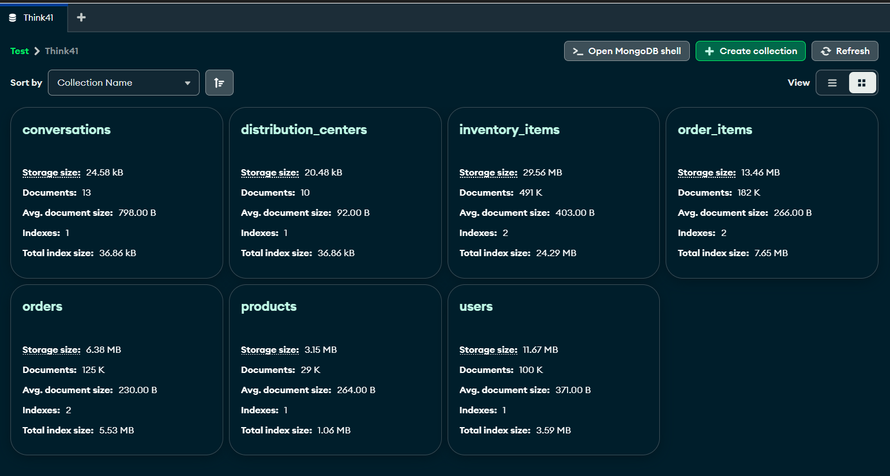
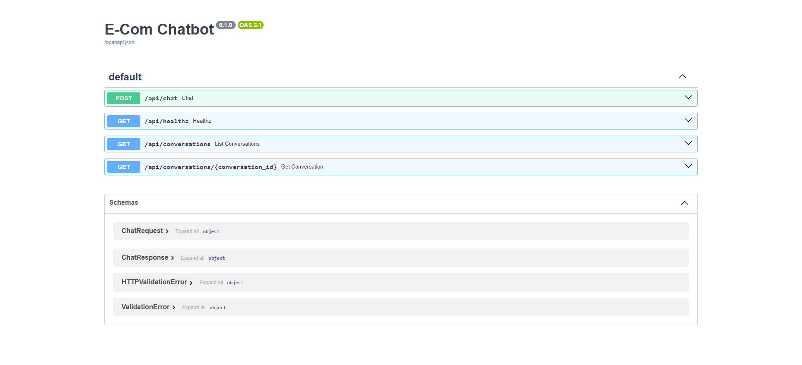

# E‑Commerce Customer Support Chatbot  
**Think41 — 2nd Interview Project**

A container‑ready, full‑stack chatbot that answers product, inventory, and order‑status questions for a fictitious clothing retailer.

<p align="center">
  <br/>
  <em>📊 Full dashboard – conversation list + chat window</em>
</p>

<p align="center">
  <br/>
  <em>💬 Sample session answering the four mandatory questions</em>
</p>

<p align="center">
  <br/>
  <em>🗄️ MongoDB collections after CSV ingestion (≈ 1 M rows)</em>
</p>

<p align="center">
  <br/>
  <em>⚙️ Auto‑generated FastAPI docs – chat & conversation routes</em>
</p>

> **🎥 Demo video – *coming soon***  
> _I will embed a YouTube link here once the walkthrough is recorded._


## 📋 Assignment Recap

| Milestone | Goal |
|-----------|------|
| 1 | Repo & env setup (backend + frontend folders) |
| 2 | **DB load** – ingest six CSVs into MongoDB |
| 3 | Design schema for multi‑user conversation history |
| 4 | Core REST API `/api/chat` |
| 5 | Integrate **Groq LLM (compound‑beta)** for natural‑language replies |
| 6 – 8 | Build React UI (ChatWindow, MessageBubble, UserInput, history panel) |
| 9 | End‑to‑end integration (CORS, state, API hook) |
| 10 | **Dockerize** all services & write documentation |

Dataset: <https://github.com/recruit41/ecommerce-dataset>  
Requirements excerpt (problem statement) is reproduced [here](./docs/problem_statement.md) for archival.

---

## 🏗️ Design Philosophy & Approach

1. **DB‑first, LLM‑second**  
   *Frequently‑asked queries (“top 5 sold products”, stock left, order status) are answered straight from MongoDB pipelines.*  
   When a DB answer is partial or absent, we fall back to the LLM with recent context.

2. **FastAPI** for quick async IO + automatic OpenAPI docs (see screenshot).

3. **Groq compound‑beta** instead of GPT 3.5:  
   *Free tier, OpenAI‑compatible SDK, ~2‑3× faster in practice.*

4. **Next.js 14 + React 18 (app router)** with **CSS Modules**  
   (simpler than Tailwind for the assignment after issues encountered).

5. **React Context** over Redux/Zustand: lightweight; we only need messages, loading state, conversation list, and userId.

6. **Container‑first** — devs/testers run `docker‑compose up --build` once and everything (Mongo + backend + frontend) is live.

---

## 🗺️ Architecture Overview

```

docker‑compose
│
├─ mongo            # seeded by ingest.py
│
├─ backend (FastAPI)
│   ├─ /api/chat                POST   chat endpoint
│   ├─ /api/conversations       GET    list
│   └─ /api/conversations/{id}  GET    detail
│
└─ frontend (Next.js 14)
├─ ConversationPanel
├─ ChatWindow / MessageBubble / InputArea
└─ ChatContext (React state)

```

### Message Flow

```

User → React → POST /api/chat
↳ quick DB pipeline?        YES → json answer
NO  → Groq LLM
↑ recent msgs (5)  ↑ optional DB\_RESULT

````

---

## ⚡ Quick Start (Recommended: Docker)

```bash
git clone https://github.com/Harshit-Dhundale/Think41_2_Interview.git
cd Think41_2_Interview

# 1. root .env
cat <<EOF > .env
MONGO_DB=ecom
GROQ_API_KEY=sk-xxxxxxxxxxxxxxxxxxxxxxxx
EOF

# 2. one‑shot build & run
docker compose up --build
````

| Service                     | URL                                                      |
| --------------------------- | -------------------------------------------------------- |
| Frontend (Next.js)          | [http://localhost:3000](http://localhost:3000)           |
| Backend Swagger UI          | [http://localhost:8000/docs](http://localhost:8000/docs) |
| Mongo (if you need Compass) | `mongodb://localhost:27017/ecom`                         |

> On first run the `backend` container executes `python app/ingest.py` (≈ 1 minute – loads 6 CSVs, builds indexes).

---

## 🛠️ Local Development (without Docker)

<details>
<summary>Show steps</summary>

```bash
# MongoDB
docker run -d -p 27017:27017 --name mongo mongo:6

# Backend
cd backend
python -m venv .venv && source .venv/bin/activate
pip install -r requirements.txt
export MONGO_URI=mongodb://localhost:27017/ecom
export GROQ_API_KEY=sk-...
python app/ingest.py      # 1‑time load
uvicorn app.main:app --reload --port 8000

# Frontend
cd ../frontend
npm install
echo "NEXT_PUBLIC_BACKEND_URL=http://localhost:8000" > .env
npm run dev               # http://localhost:3000
```

</details>

---

## 📂 Key Files & Folders

```
backend/
  Dockerfile
  app/
    chat.py            # /api/chat route
    queries.py         # DB pipelines (top sold, stock left, etc.)
    llm.py             # Groq client wrapper
    ingest.py          # CSV → Mongo loader
frontend/
  Dockerfile
  src/components/…     # UI
  src/context/ChatContext.tsx
docker-compose.yml
README.md
```

---

## 🔑 Environment Variables

| Scope             | Keys                                       |
| ----------------- | ------------------------------------------ |
| **root `.env`**   | `MONGO_DB` `GROQ_API_KEY` (docker compose) |
| **backend/.env**  | `MONGO_URI` (overridden in compose)        |
| **frontend/.env** | `NEXT_PUBLIC_BACKEND_URL`                  |

---

## 🧪 Sample Queries to Try

| Question                                           | Expected behaviour                             |
| -------------------------------------------------- | ---------------------------------------------- |
| “What are the **top 5 most sold products**?”       | Aggregation pipeline returns list (with units) |
| “Show me the **status of order ID 12345**.”        | Exact match in `orders` collection             |
| “How many **Classic T‑Shirts** are left in stock?” | Counts unsold items in `inventory_items`       |
| Free‑form follow‑ups                               | Routed to Groq LLM with context                |

---